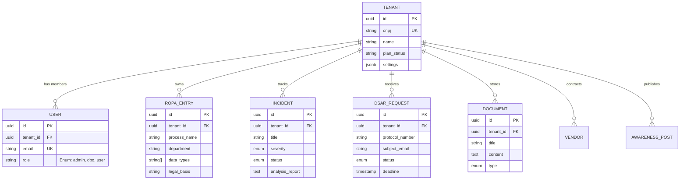

# LGPD Guardian - SaaS Architecture & Project Structure

## 1. High-Level Architecture
The platform is designed as a **Multi-tenant SaaS** where data isolation is the highest priority. We utilize a "Shared Database, Separate Schema Logic" approach where all tables (except global configs) have a `tenant_id` Foreign Key.

### Tech Stack
*   **Frontend:** React 19, TypeScript, TailwindCSS, Lucide Icons, Recharts.
*   **AI Layer:** Google Gemini 2.5 Flash (via `@google/genai`) for document generation and incident analysis.
*   **Backend (Planned):** Python (FastAPI/Django) or Node.js (NestJS).
*   **Database:** PostgreSQL 14+ (Relational, ACID compliant).
*   **Auth:** OAuth 2.0 (Google) + Custom RBAC.

## 2. Project Folder Structure

```
/
├── backend/                # [Planned] API Source Code
│   ├── app/
│   │   ├── main.py         # Entry point
│   │   ├── api/            # Route controllers
│   │   ├── core/           # Config, Security, Middleware
│   │   ├── models/         # SQLAlcemy/Prisma models
│   │   ├── schemas/        # Pydantic/Zod schemas
│   │   └── services/       # Business logic (ROPA, Incidents)
│   └── Dockerfile
│
├── frontend/               # Current React Application
│   ├── src/
│   │   ├── components/     # Reusable UI components (Layout, Cards, Forms)
│   │   ├── pages/          # Page views (Dashboard, RopaManager, etc.)
│   │   ├── services/       # API clients (Gemini, Backend fetchers)
│   │   ├── types.ts        # Shared TypeScript interfaces
│   │   ├── constants.ts    # Global constants
│   │   └── App.tsx         # Main Router
│   ├── index.html
│   └── metadata.json
│
├── database/
│   ├── schema.sql          # DDL for PostgreSQL
│   └── seeds.sql           # Initial seed data for dev
│
└── docs/
    └── architecture.md     # This file
```

## 3. Database Schema (ER Diagram)

The following diagram represents the PostgreSQL schema defined in `schema.sql`.



## 4. Security & Compliance Strategy
*   **Isolation:** Every SQL query in the backend MUST include `WHERE tenant_id = :current_user_tenant_id`.
*   **Audit Logging:** Critical actions (deleting ROPA, changing Incident status) will be logged to a separate `audit_logs` table (future implementation).
*   **Encryption:** Sensitive columns (like `subject_email` in DSAR) should be encrypted at rest using pgcrypto or application-level encryption.
